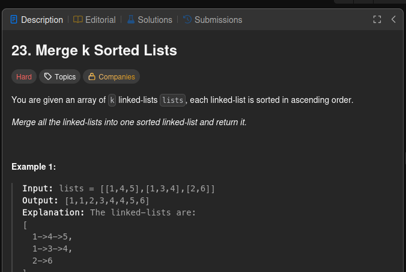
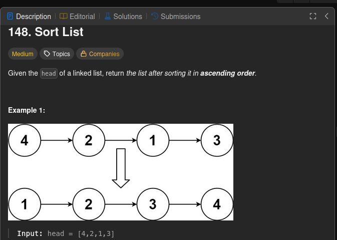

# Dividir e Conquistar: Resolvendo Problemas do LeetCode

**Número da Lista**: 4 
**Conteúdo da Disciplina**: Dividir e Conquistar  

### Participantes
Nome | Matrícula
|--|--|
[Christian Hirsch Santos](https://github.com/crstyhs)| 211045113
[Ian Lucca Soares Mesquita](https://github.com/IanLucca12) | 211045140 

## Sobre 
Foram escolhidos quatro exercícios da plataforma online [LeetCode](https://leetcode.com/):
- três de nível difícil.
- um de nível médio.

## Screenshots
### Questão
### [23. Merge k Sorted Lists (Hard)](https://leetcode.com/problems/merge-k-sorted-lists/description/)

### Envio correto

### Tentativas

**[Solução do Problema](hard/23_merge_k_sorted_lists.py)**

### Questão
### [148. Sort List (Mid)](https://leetcode.com/problems/sort-list/description/)

### Envio correto

### Tentativas

**[Solução do Problema](hard/148_sort_list.py)**

### [4. Median of Two Sorted Arrays](https://leetcode.com/problems/median-of-two-sorted-arrays/description)

### Envio correto

### Tentativas

**[Solução do Problema](hard/4_median_of_two_sorted_arrays.py)**

## Vídeo Explicativo

[Apresentação]()

## Linguagens
Python 

## Uso 
Rode os códigos no site do [LeetCode](https://leetcode.com/), em cada um dos problemas.